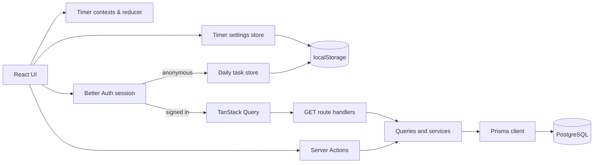
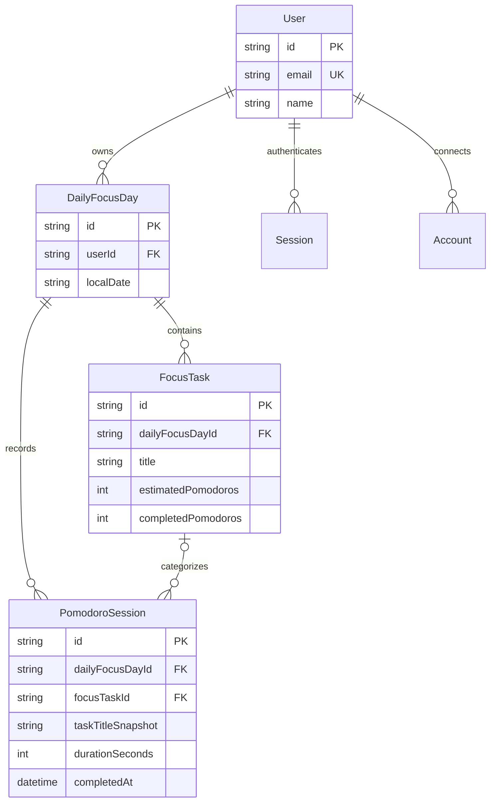

# Pomodoro Architecture

**Document type:** As-built reference  
**Baseline:** `master` at commit `5120909`

## 1. System Overview

Pomodoro is a Next.js App Router application with client-side timer state and
two task-persistence paths. Anonymous task state stays in the browser. Once a
Better Auth session is available, task and session operations use the server and
PostgreSQL.

The timer itself always runs in the browser. Authentication changes where focus
tasks and completed Pomodoro sessions are stored; it does not move timing into a
server process.

## 2. Application Structure

| Area                            | Responsibility                                              |
| ------------------------------- | ----------------------------------------------------------- |
| `src/app/(app)`                 | Main timer page and shared application shell                |
| `src/app/statistics`            | Authenticated seven-day statistics page                     |
| `src/app/api/auth`              | Better Auth catch-all route                                 |
| `src/app/api/focus-tasks`       | Authenticated task reads                                    |
| `src/app/api/pomodoro-sessions` | Authenticated daily session counts                          |
| `src/app/api/statistics`        | Authenticated statistics reads                              |
| `src/components/timer`          | Timer tabs, countdown UI, controls, and completion view     |
| `src/components/focus-task`     | Task forms, filters, list, sidebar, and active-task panel   |
| `src/components/statistics`     | Daily and per-task charts                                   |
| `src/lib/contexts`              | Timer instance data/API and shared timer status             |
| `src/lib/stores`                | Zustand task and settings stores                            |
| `src/lib/hooks`                 | Timer behavior and query/mutation adapters                  |
| `src/lib/services`              | Authenticated mutations and transactional domain operations |
| `src/lib/data`                  | Authenticated database reads                                |
| `src/lib/schemas.ts`            | Zod validation at form and server boundaries                |
| `prisma/schema.prisma`          | PostgreSQL data model                                       |

The root layout owns browser-wide timer settings and common UI providers. The
`(app)` layout owns the daily task store, shared timer status, responsive
sidebar, header, and footer.

## 3. Timer State

`useTimer` implements a reducer with four states:

| State       | Meaning                                              | Allowed transition sources |
| ----------- | ---------------------------------------------------- | -------------------------- |
| `idle`      | Timer is reset and accepts a new configured duration | Initial mount or reset     |
| `running`   | Elapsed seconds increase once per second             | Start or resume            |
| `paused`    | Elapsed progress is preserved                        | Pause                      |
| `completed` | The configured end has been reached                  | Final running tick         |

Internally, the reducer counts elapsed seconds upward from `sessionMin` to
`sessionMax`. The circular progress component converts this to remaining time
for display. The active timer owns an interval only while running and clears it
when the status changes or the component unmounts.

Each tab mounts its own `Timer` and `TimerContextProvider`. Switching tabs
therefore resets timer-instance state. A separate `TimerStatusProvider` exposes
the current status to the task list so task selection can be disabled while a
session is running.

Completion is guarded by a ref in `CountdownTimer`, ensuring that changes to an
`onComplete` callback do not record the same completion twice.

## 4. Client State and Persistence

### Timer settings

`createTimerSettingsStore` persists the Pomodoro duration and notification
volume under the `timer-settings` local-storage key. Persisted values are parsed
with `timerSettingsSchema` before they replace defaults.

### Anonymous daily tasks

`createDailyFocusTasksStore` owns:

- `localDate`
- `tasks`
- `activeTaskId`
- Local task mutation actions

Anonymous state is persisted under `daily-focus-tasks`. During hydration, the
store validates the persisted payload. For a new local day it retains incomplete
tasks, removes completed tasks from the active daily list, and preserves the
active selection only if that task was carried forward.

### Authenticated daily tasks

`AppProvider` keys the daily task provider by the authenticated user ID. In
signed-in mode, persistence middleware is disabled and `FocusTaskSidebar` loads
the current tasks through TanStack Query. Query results replace the in-memory
Zustand task list used by the UI.

Mutations use server actions and invalidate the relevant query keys after
success. This keeps the database authoritative while allowing both data contexts
to use the same task components and selectors.

## 5. Authentication and Request Boundaries

Better Auth uses the Prisma adapter and exposes Google and Spotify social
providers through `src/app/api/auth/[...all]/route.ts`.

`getSession` is the shared server-side session boundary. Server actions and
authenticated route handlers check it before accessing user data. The
statistics route is also guarded by `src/proxy.ts`, which redirects requests
without a session cookie to the home page. The statistics API still performs
its own session check; the cookie guard is navigation behavior rather than the
authorization boundary.

The browser supplies its IANA time-zone identifier with task, completion, and
statistics requests. `timeZoneSchema` validates that identifier before it is
used for local-date calculation.

## 6. Data Model

`DailyFocusDay` is unique by `(userId, localDate)`. This makes the user's local
calendar day the boundary for task ownership and daily statistics without
storing a time zone on every record.

`PomodoroSession.focusTaskId` is optional and uses `SetNull` when a task is
removed. `taskTitleSnapshot` preserves the reporting label independently of the
task's later title or lifecycle.

Better Auth also owns the `Session`, `Account`, and `Verification` models.

## 7. Main Data Flows

### Complete a Pomodoro anonymously

1. `TimerTabs` receives a completion from the timer.
2. `completeActivePomodoro` updates the active task in the Zustand store.
3. Persist middleware writes the updated daily state to local storage.
4. The UI switches to the completion view and offers the next timer choice.

### Complete a Pomodoro while signed in

1. `TimerTabs` calls the `completePomodoro` server action with duration, active
   task ID when present, and browser time zone.
2. The service validates the session and payload.
3. A Prisma transaction gets or creates the current `DailyFocusDay`.
4. If the active task belongs to that day and remains incomplete, its completed
   count is advanced with a guarded update.
5. The transaction creates a `PomodoroSession`, including a task ID and title
   snapshot when applicable.
6. The client invalidates focus-task and daily-count queries, then displays the
   completion view.

### Load the authenticated daily task list

1. TanStack Query calls `GET /api/focus-tasks` with the browser time zone.
2. The route validates the session and time zone.
3. The query gets or creates today's `DailyFocusDay`.
4. Older incomplete tasks are reassigned to today's record.
5. Today's tasks replace the in-memory UI store.

### Load statistics

1. The signed-in user opens `/statistics`.
2. The client calls `GET /api/statistics/focus` with the browser time zone.
3. The server calculates the latest seven local dates and returns matching
   sessions ordered by completion time.
4. The client groups sessions by date and task-title snapshot for charting.

## 8. Server Interfaces

### Route handlers

| Method and path                                 | Purpose                                   | Authentication             |
| ----------------------------------------------- | ----------------------------------------- | -------------------------- |
| `GET /api/focus-tasks?timeZone=...`             | Load and roll forward daily tasks         | Required                   |
| `GET /api/pomodoro-sessions/today?timeZone=...` | Count today's completed sessions          | Required                   |
| `GET /api/statistics/focus?timeZone=...`        | Load seven days of session data           | Required                   |
| `/api/auth/[...all]`                            | Better Auth endpoints and OAuth callbacks | Provider/session dependent |

### Server actions

| Action             | Responsibility                                                 |
| ------------------ | -------------------------------------------------------------- |
| `createFocusTask`  | Validate and create a task in today's focus day                |
| `updateFocusTask`  | Validate ownership and update an incomplete task               |
| `deleteFocusTask`  | Validate ownership and delete a task                           |
| `completePomodoro` | Advance eligible task progress and record a session atomically |

## 9. Validation and Failure Handling

Zod schemas validate time zones, UUIDs, task inputs, timer settings, and
completion payloads. Server mutations repeat validation even when the client
form has already validated its values.

Authenticated writes use user-scoped lookups or daily-focus-day ownership
checks. Task completion uses a guarded `updateMany` inside a transaction to
detect a concurrent progress change rather than silently overwriting it.

Route handlers return structured JSON errors with HTTP `400`, `401`, or `500`
status codes. Client hooks convert unsuccessful responses into `Error` objects,
and the UI presents inline errors, loading placeholders, or toast feedback as
appropriate.

## 10. Testing and Delivery

Vitest runs in a jsdom environment with Testing Library setup from
`src/testing/setup-tests.ts`. Tests are colocated with timer hooks, Zustand
stores, schemas, forms, task lists, settings, and interactive timer components.

The pull-request CI workflow uses Node.js 24 and performs:

1. `npm ci`
2. `npm run lint`
3. `npm test -- --run`
4. `npm run build`

Prisma Client generation runs through the package `postinstall` script.
